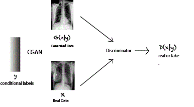
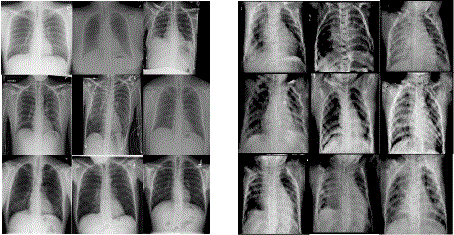
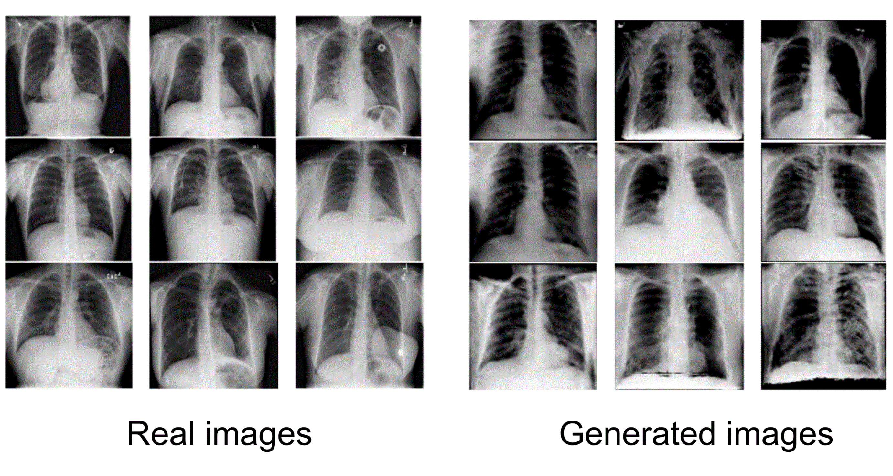

# XRAY-GAN: Conditional and Unconditional Score-guided GAN for Chest X-ray Pathology Classification

Joy Chen, Qingfu Wan


*This is the repository for the final project of "Machine Learning - CSCI-GA.2565-001" Spring 2021 at NYU Courant.* 


----


# Pipelines

   ## CGAN


<p align="center">  
  
</p> 

  ## UCGAN
  
  
<p align="center">  
  
</p> 

----


# General Structure

   ```
   ${ROOT}
   +-- experiments
   +-- figs   
   +-- code
   +-- full_code
   +-- README.md
   ```

# Clean Code
   
   `${ROOT}/code/`
   
# The Complete Set of Code
   
   `${ROOT}/full_code/`


----
# GANerated Images
----
   
**Left**: Real Data; **Right**: Generated Data


## CGAN

Clear indication of ribs, spine, and heart shading.

<p align="center">  
  
</p> 

## UCGAN

Clear spines, lungs, and varied contrastness \& color gradient.


<p align="center">  
  
</p> 


----
## Enjoy!~
----
   
